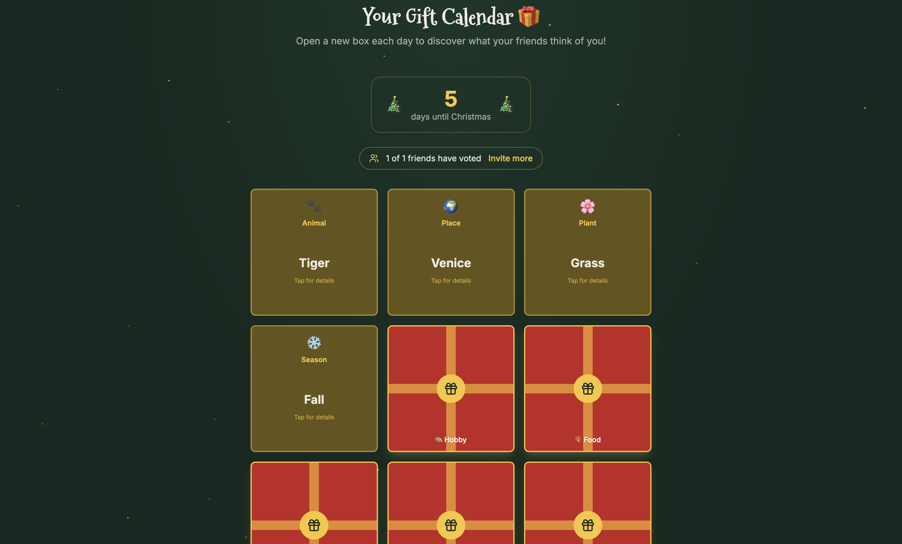

# 🎄 Christmas Wrapped

A holiday-themed gift calendar app where friends vote on what best represents you across fun categories — then you unwrap the results one day at a time before Christmas!




## Features

- **🎁 Personal Gift Calendar** — Each user gets a unique calendar with 9 categories to reveal
- **👥 Invite Friends** — Send email invitations for friends to vote on your calendar
- **🗳️ Voting System** — Friends answer fun prompts like "What animal represents this person?" or "What's their aura color?"
- **📦 Daily Reveals** — Unwrap gift boxes to see aggregated votes and who voted for what

## Getting Started

### 1. Clone & Install

```bash
git clone https://github.com/yourusername/christmas-wrapped.git
cd christmas-wrapped
pnpm install
```

### 2. Set Up Supabase

1. Create a new project at [supabase.com](https://supabase.com)
2. Run the SQL from `schema.sql` in the Supabase SQL Editor to create tables, triggers, and seed data
3. Enable Email Auth in Authentication → Providers

### 3. Configure Environment

Create a `.env.local` file that follows the structure provided in the `.env.example` file

### 4. Run Development Server

```bash
pnpm dev
```

Open [http://localhost:3000](http://localhost:3000) to see the app.

## How It Works

### For Calendar Owners

1. **Sign up** with your email
2. **Generate your calendar** to get a unique calendar code
3. **Invite friends** by entering their email addresses
4. **Wait for votes** — see who has voted
5. **Reveal gifts** — open boxes to discover what friends think of you!

### For Voters (Friends)

1. **Receive invitation** via email or direct link
2. **Sign up/Log in** to vote
3. **Answer prompts** across 9 categories
   - 🐾 Animal that represents them
   - 🌍 Place that fits their vibe
   - 🌸 Plant personality match
   - ❄️ Season energy
   - 🎨 Hobby they'd master
   - 🍕 Comfort food soulmate
   - 🎨 Aura colour
   - 🎭 Fictional character twin
   - 💌 Personal note/message

## 🧪 Development

### Test Mode

In `lib/constants.ts`, set `TEST_MODE = true` to bypass date-based unlock restrictions, allowing you to reveal the giftboxes anytime ignoring the countdown to Christmas:

```typescript
export const TEST_MODE = true; // All boxes openable immediately
```

## 📄 License

This project is licensed under the terms in the [LICENSE](LICENSE) file.